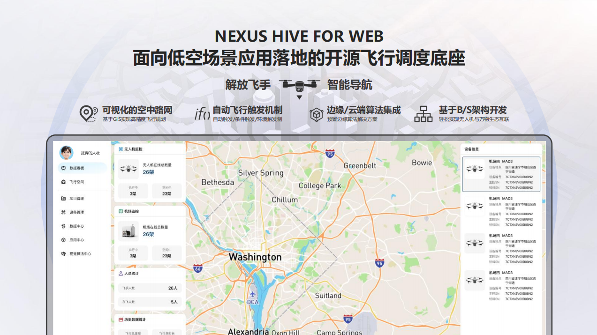
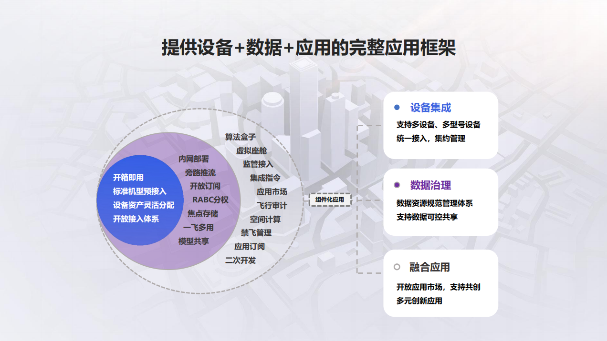

# Nexus Hive for Web低空智能飞行调度平台

## 概述

一款基于 **大疆上云API (DJI Cloud API)** 开发的工业级低空无人机智能调度与管理平台。后端采用 **BuildAdmin** 框架，提供稳定高效的API服务；前端三维可视化基于 **Mars3D** 引擎，呈现炫酷真实的作业场景。实现了对无人机机队的集中化、自动化、可视化管控，赋能能源巡检、工程测绘、安防监控等低空作业场景。

## 技术栈

- **后端框架**: BuildAdmin (基于ThinkPHP和Vue的CRUD快速开发框架)
- **三维引擎**: Mars3D (强大的三维地球平台)
- **云服务**: 大疆上云API (DJI Cloud API)
- **主要功能**: 项目分区管理、设备监控、远程控制、可视化航线编辑、任务调度、数据导出

## 核心功能

### 🗂 多维管理
- **项目管理**：按项目维度集中管理所有无人机资源与任务。
- **分区管理**：灵活划分和管理作业区域，实现精细化调度。
- **设备管理**：全面接入并管理大疆机场(Dock)及飞行器，实时查看设备状态、告警信息、机场及飞行器详请数据。

### 🛩 远程调度与控制
- **多机型支持**：目前已支持大疆机场2 (Dock 2)、大疆机场3 (Dock 3) 的接入与管理，后续将扩展更多机型。
- **远程运维**：可对远程机场进行重启、升级、参数配置等运维操作。
- **一键指令**：支持任务一键下发、一键返航、紧急中止等快捷操作。

### ✈️ Mars3D可视化任务编辑
- **三维飞行空间**：基于Mars3D引擎提供强大的三维可视化航线编辑器，在地球上直接绘制、拖拽修改航线。
- **丰富动作指令**：航线支持添加多种动作，包括：
    - 拍照、录像
    - 悬停等待
    - 飞行器偏航角调整
    - 云台俯仰角控制
    - 相机变焦 (Zoom In/Out)
- **三维实时监控**：在三维场景中实时监控任务执行全过程，动态更新飞机位置、姿态与状态。

### 📊 数据与报告
- **飞行记录导出**：一键导出完整的飞行任务记录与报告，便于后续分析与审计。
- **设备告警历史**：查看所有设备的历史告警信息，助力设备健康管理。
## 关于部署
- **环境准备清单**： 

 ***后端***： 
        
        PHP > 8.0
        Mysql  5.7
        Redis  6.2
        Workerman 3.5.34
        EMQX 4.4
 ***前端***： 
        
        Node
            node.js > 20.19.0
            node.js: 22.x (推荐)
        核心框架
            Vue: 3.5.13 (Vue 3 组合式API)
            TypeScript: 5.7.2
            Vite: 6.3.5 (构建工具)
            Vue Router: 4.5.0 (路由管理)
            Pinia: 2.3.0 (状态管理)
        UI组件库
            Element Plus: 2.9.1 (主要UI组件库)
            Element Plus Icons: 2.3.1 (图标库)
            Font Awesome: 4.7.0 (图标字体)
        地图与3D渲染
            Mars3D: 3.10.0 (三维地球平台)
            Mars3D Cesium: 1.131.1 (Cesium引擎)
            Mars3D Space: 3.10.0 (空间分析)
            @turf/turf: 7.2.0 (地理空间分析)
        通信与实时功能
            MQTT: 5.13.3 (消息队列)
            Agora RTC SDK: 4.23.4 (实时音视频)
            Axios: 1.9.0 (HTTP客户端)

 ***宝塔部署***： 
        
        宝塔新建站点，设置站点目录为public

        根目录执行命令  composer install 安装依赖

        本地启动则在根目录 php think run， 指定端口php think run -p【端口号】

        前端本地启动则在根目录 yarn ， yarn dev， 注意修改项目.env.development对应接口路径

        伪静态：
        location ~* (runtime|application)/{
        	return 403;
        }
        location / {
        	if (!-e $request_filename){
        		rewrite  ^(.*)$  /index.php?s=$1  last;   break;
        	}
        }

        需要守护进程在根目录启动 Workerman：

        php think worker:server 

 ***注意事项***： 
        
        后端源码地址:https://gitee.com/nanzhu666/NexusHive.git
        前端端源码地址:https://gitee.com/nanzhu666/Nexus-Hive-Web.git
        部署前请先保证emqx访问正常，并将机场部署至对应的第三方云，同时mqttx能够订阅thing/product/{机场SN}/osd并收到消息推送
        目前媒体支持只支持OSS，请开通bu# Nexus Hive for Web低空智能飞行调度平台
        目前直播用的声网Agora的极速直播，请在前端配置文件中配置声网token授权的访问域名，如果需要rtmp，可以查看前端部分代码，改动直播类型即可
        目前已更新安装器，部署完成访问即可跟随安装进入后台

        
## 开源协议

本项目采用 Apache License 2.0 开源协议，详情请参阅 [LICENSE](LICENSE) 文件。

## 交流与贡献

欢迎提交 Issue 和 Pull Request！
-   **社区交流群**：请加群获取前端代码、数据库文件及详细开发文档。
    

-   **邮箱联系**：261003520@qq.com
### 特别鸣谢
- [Thinkphp](http://www.thinkphp.cn/)
- [FastAdmin](https://gitee.com/karson/fastadmin)
- [Vue](https://github.com/vuejs/core)
- [vue-next-admin](https://gitee.com/lyt-top/vue-next-admin)
- [Element Plus](https://github.com/element-plus/element-plus)
- [TypeScript](https://github.com/microsoft/TypeScript)
- [vue-router](https://github.com/vuejs/vue-router-next)
- [vite](https://github.com/vitejs/vite)
- [Pinia](https://github.com/vuejs/pinia)
- [Axios](https://github.com/axios/axios)
- [nprogress](https://github.com/rstacruz/nprogress)
- [screenfull](https://github.com/sindresorhus/screenfull.js)
- [mitt](https://github.com/developit/mitt)
- [sass](https://github.com/sass/sass)
- [echarts](https://github.com/apache/echarts)
- [vueuse](https://github.com/vueuse/vueuse)
- [lodash](https://github.com/lodash/lodash)
- [eslint](https://github.com/eslint/eslint)
- [prettier](https://github.com/prettier/prettier)
- [Sortable](https://github.com/SortableJS/Sortable)
- [v-code-diff](https://github.com/Shimada666/v-code-diff)
- [clicaptcha](https://github.com/hooray/clicaptcha)
- [phinx](https://github.com/cakephp/phinx)
- [buildAdmin](https://www.buildadmin.com/)
- [mars3d](http://mars3d.cn/)
- [DJI SDK](https://developer.dji.com/)
- [jetbrains](https://www.jetbrains.com/)
## 免责声明

本项目是基于大疆云API进行的二次开发，使用时请遵守大疆的开发者协议及相关法律法规。开发者不对因使用本项目而产生的任何直接或间接损失负责。