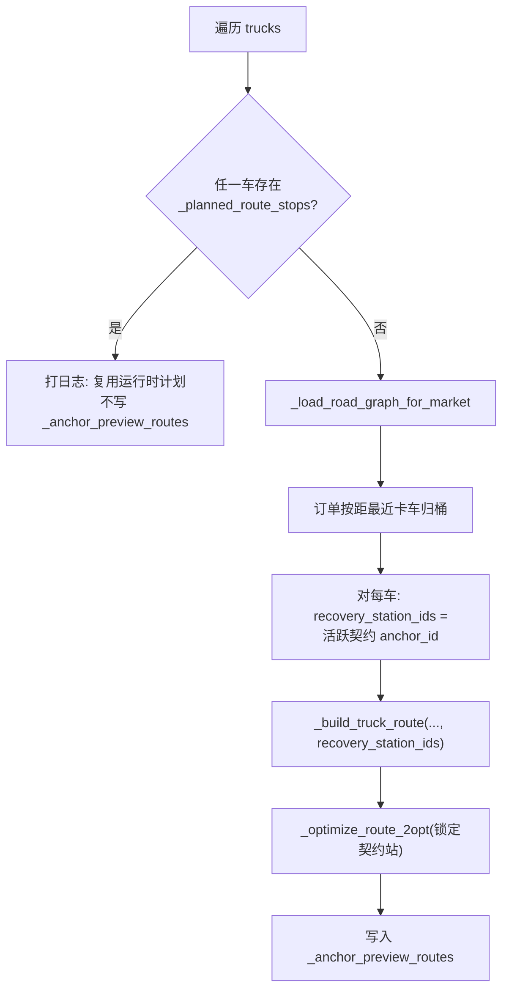
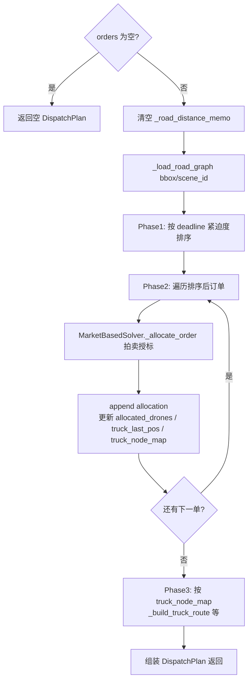
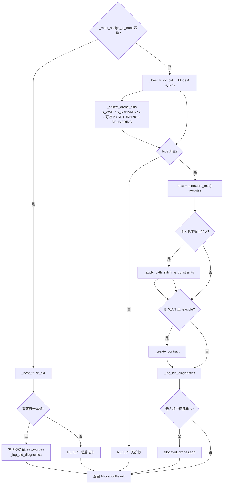
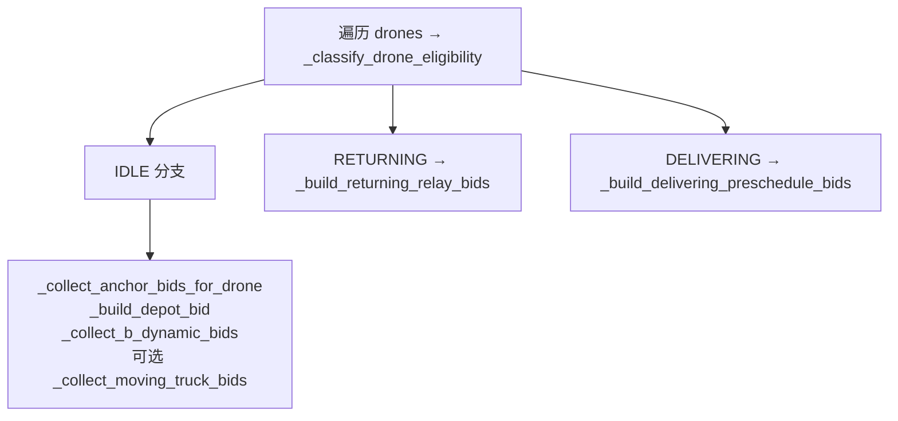

# 市场拍卖调度 — 代码实现说明

本文档描述 `backend/solver/market_based_solver.py` 的**当前实现**，与仓库内其他设计/公式文档对照阅读。实现类 `MarketBasedSolver` **继承** `GreedyMMCE`，复用 OSM 路网加载、`_build_truck_route`、`_score_allocation`、`DispatchPlan` / `AllocationResult` 及 `decision_engine` 执行链。**算法目标、决策变量、分配/路径、增量方式与汇合点确定**的集中说明见下文 **「市场拍卖算法说明」**；流程图见其后 **「流程图」** 一节。

**设计原则（动态拍卖约束协议）**：**状态决定权限，执行即锁定，路径必闭环**。

---

## 市场拍卖算法说明（建模与实现摘要）

本节从**优化目标、决策变量、分配与路径构造、增量机制、车机协同与汇合点**五个角度概括 `MarketBasedSolver` 的当前实现；细节仍以代码与后文各节为准。

### 算法形态（拍卖市场在做什么）

- **协调器**：`MarketBasedSolver` 在父类 `GreedyMMCE._dispatch_impl` 的 **Phase 2** 中，对**每一张待分配订单**调用重写的 `_allocate_order`，扮演「单任务顺序拍卖」的协调器。
- **竞标者**：同一订单上，**所有卡车**可投 **Mode A**（直递）；**满足准入的无人机**可投 **B_WAIT / B_DYNAMIC / C** 等（及可选 **B** 移动起飞、RETURNING/DELIVERING 串联 **C**）。超重订单仅允许卡车投标（强制卡车分支）。
- **授标规则**：收集本订单全部可行投标后，取 **`score_total` 最小**的一条作为中标（无标则 `REJECT`）。**非**迭代抬价拍卖，而是「一次性收集标 + 最低价中标」的**密封标式**决策。
- **与贪心底座的关系**：路网距离、能耗模型、`DispatchPlan` / `AllocationResult` 与 Phase 3 卡车路径构建仍继承 `GreedyMMCE`；**模式选择**从基线的「按优先级试 B→C→A」改为「多模式并行竞价 + 标量目标最小化」。

### 优化目标（最小化什么）

对**每一次授标**，比较的是投标上的 **`score_total`**（标量，越小越好）。其组成因模式而异（详见 §10）：

| 组成部分 | 典型含义 | 写入 `AllocationResult` 的字段 |
|----------|----------|----------------------------------|
| `cost_dist` | 距离加权：卡车段（含边际或全量口径）+ UAV 航段 | `cost_dist` |
| `cost_energy` | 能耗加权：与上对应的卡车 / UAV 能耗 | `cost_energy` |
| `cost_penalty` | 时间窗违约：`LAMBDA_TIME × penalty_rate × max(0, ETA − deadline)` | `cost_penalty` |
| `cost_wait` / `cost_risk` | B/B_WAIT：**机等车 / 车等机**非对称等待；贴近锚点**生死线**的风险溢价 | **仅**进 `score_total`，不进三成本字段 |
| `cost_backtrack` / 边际绕路能耗附加 / `path_bonus` | 市场层方向性：**回头路惩罚**、绕路能耗放大、**顺路邻近奖励**（减分） | 同上，仅影响授标 |

**计划级汇总**（`_recalculate_actual_plan_costs`）：按本轮最终 **`truck_routes` 全量里程**与 UAV 几何航段重算 `plan.cost_total` 与 `summary["cost_breakdown"]`**，不把**上述仅用于竞价的附加项（`cost_wait`、`cost_risk`、回头路等）**摊入该汇总，避免与真实执行账本重复或口径混淆。

一句话：**拍卖阶段最小化「加权距离 + 能耗 + 迟罚 + 协同与时间风险 + 方向性修正」的标量 `score_total`；回传计划后再用真实路径重算账本成本。**

### 决策变量（每一单在选什么）

实现上是**离散组合优化**（无连续变量求解器）：每张订单在有限候选集合中选 **一条** `AllocationResult`，主要离散决策包括：

| 决策维度 | 取值来源 / 说明 |
|----------|-----------------|
| **履约模式** | `A` / `B` / `B_WAIT` / `B_DYNAMIC` / `C` / `REJECT` |
| **卡车** | `vehicle_id`（Mode A / B / B_WAIT / B_DYNAMIC 等涉及卡车时） |
| **无人机** | `drone_id`（非 A 模式）；本轮已中标无人机进入 `allocated_drones`，后续订单不得重复占用 |
| **起飞 / 回收锚点** | `launch_station_id`、`recovery_station_id`（B_WAIT 等为充电站或仓库 ID）；由锚点时刻表枚举产生 |
| **时刻类字段** | 如 `launch_time`、`wait_duration`（用于 B_WAIT 与 Phase 3 站点等待映射） |
| **契约（B_WAIT 中标后）** | 向 `_active_contracts` 追加一条 `RendezvousContract`，锁定 `(truck, drone, recovery_anchor, 时间窗)`，属**硬约束状态**而非连续变量 |

父类在 Phase 2 中维护的 **`truck_last_pos[truck_id]`** 用于估计 Mode A 等下的**卡车尾点**（边际插入），随订单顺序更新；与「汇合锚点几何位置」分离，后者由站点实体坐标决定。

### 任务分配与路径构造方式

**任务分配（谁送哪一单）**

1. **Phase 1**（父类）：对本轮输入订单集按 **deadline 紧迫度**排序（越早截止、剩余时间越短越靠前）。
2. **Phase 2**：按该顺序**逐单**调用 `_allocate_order`；每单内部为**单任务拍卖**；中标后更新 `allocated_drones`、`truck_last_pos`、`truck_node_map`（Mode A 累积客户点；B/B_WAIT 累积回收站 / 起飞站等）。
3. **性质**：整体是 **顺序启发式**（myopic），**不为后续订单做显式前瞻**；后续单只能通过已存在的契约、锁定无人机与更新后的 `truck_last_pos` 间接受影响。

**路径构造**

| 路径类型 | 构造时机与函数 | 说明 |
|----------|----------------|------|
| **卡车主干（计划输出）** | Phase 3 `_build_truck_route`（父类） | 基于 `truck_node_map` 中本轮 Mode A 客户点 + B/B_WAIT 相关回收/起飞站需求，OSM 最近邻 + 顺路充电站插入等（与贪心基线一致）。增量场景下可对 `start_pos`、是否回仓等使用父类参数。 |
| **锚点预览（仅服务拍卖）** | `_prepare_anchor_preview_routes` → `_build_truck_route` + `_optimize_route_2opt` | 写入 `_anchor_preview_routes`，供 `_build_anchor_timetable` 广播「卡车将经过哪些充电站及何时到达」，**不等于**仿真中已执行的卡车路由（执行路由由 `DispatchDecisionEngine` 下发）。 |
| **无人机航路** | 求解器内主要生成 **投标与分配字段**；空间上可执行的 `route_plan` 由 **决策引擎** 根据 `AllocationResult` 装配 | 市场层通过 `_apply_path_stitching_constraints` 等做前瞻起点与拼接标记。 |

### 增量调度的具体方式

入口：`dispatch_incremental(new_orders, ...)`。

1. **状态刷新**：`_expire_contracts`、`_try_flexible_recovery`（与全量相同）。
2. **订单池**：仅处理 **`new_orders`** 中通过 **`_is_order_immutable`** 过滤后的子集；不可变更订单计入 `immutable_orders_skipped`，**不参与**本轮拍卖。
3. **锚点预览**：若 `_anchor_preview_routes` 仍为空，才用 `filtered_orders` 调用 `_prepare_anchor_preview_routes`；若任一车已有 **`_planned_route_stops`**，预览构建会跳过（见 §9.1），时刻表走**运行时计划分支**。
4. **核心求解**：`super().dispatch(filtered_orders, ...)`，即与全量相同的 Phase 1–3，但输入订单仅为增量子集；**`_active_contracts` 保留在求解器实例上**，跨轮次约束后续拍卖与 `_merge_contracts_into_timetable`。
5. **收尾**：成本重算、改派清理、闭环校验与空闲机归巢与全量相同；`summary["dispatch_type"] = "incremental"`。

**语义**：增量 = **在已有契约与实体状态下，仅对新进入且仍可改的订单补一轮顺序拍卖**；不重写父类「全量重排未完成单」逻辑（`should_replan_unfinished` 对 market 返回 `False`）。

### 协同方式与汇合点（位置与时间如何确定）

车机协同在本实现中核心是 **「卡车锚点时刻表 × 无人机能量与时间可行性」**；**B_WAIT 中标**后写入 **`RendezvousContract`**，把回收时空承诺固定下来。

**汇合点的空间位置（「在哪汇合」）**

- **几何位置**即所选 **`SwapStation` / `Depot` 的固定坐标** `location`（`entity_mgr.stations` / `depots`），**不是**在线优化的连续二维点。
- **Mode B_WAIT**：起飞锚点、回收锚点均为时刻表中某一 **`anchor_id`** 对应站点（通常为多组 `(launch_anchor, recovery_anchor)` 枚举，且回收不早于起飞在时间序上可解释的组合）。
- **Mode B（移动起飞）**：起飞位置为 **卡车在 `current_time` 的 `get_location`**；回收锚点仍为时刻表中的某一充电站。
- **Mode B_DYNAMIC**：起飞为锚点站，回收为**仓库**（无卡车回收汇合硬契约）。

**候选锚点与时间窗（「卡车何时到哪一站」）**

由 **`_build_anchor_timetable(truck, current_time)`** 生成有序锚点列表，每条含 `anchor_id`、`location`、`arrival_time`、`latest_rendezvous_time` 等：

1. **优先** `_anchor_preview_routes` 中 `node_type == "station"` 的节点（预览 OSM 路径上的经停充电站及到达时刻）。
2. **否则** 用卡车 **`_planned_route_stops`** 中 `node_type == "station"` 的已规划停靠。
3. **再否则** 回退 **`_predict_truck_charging_stations`**（距卡车当前位置最近的若干站点的启发式序列）。

随后 **`_merge_contracts_into_timetable`**：把**活跃契约**的回收站并入或对齐到表中对应 `anchor_id`；契约锚点 **`locked`**，且 `latest_rendezvous_time` 与契约 `latest_departure` **取较小者**；非锁定锚点按 `TIMETABLE_SLACK_RATIO` 收紧可汇合窗口。

**无人机与卡车能否在该点汇合（「可不可行」）**

- 对每一候选 **(卡车, 起飞锚点, 回收锚点, 无人机)**，**`_build_anchor_bid`** 用固定公式估算 UAV 到达回收站的 **`uav_arrival_recovery`**，并要求 **`uav_arrival_recovery ≤ recovery_anchor["latest_rendezvous_time"]`**（且能量满足 `ENERGY_SAFETY_FACTOR`）。通过者进入投标集并由 **`_score_market_b_bid`** 打分（含等待、风险、方向性等）。
- **授标后契约时间**：**`_create_contract`** 从时刻表中读出回收锚点的 **`truck_arrival` / `latest_departure`**，用中标 `launch_time` 与 UAV 速度、服务时间估算 **`uav_arrival_time`**，并令 **`t_sync = max(uav_arrival, truck_arrival) + TRUCK_DRONE_RECOVER_TIME`**，用于 **`_is_drone_locked`** 直至同步完成。

**小结**：汇合点的**空间**由「选中的充电站/仓库实体坐标」完全确定；**时间**由「锚点时刻表（预览或运行计划或启发式）+ 契约合并 + UAV 飞行时间估算」共同确定；**可行性**由离散候选过滤与 `score_total` 择优闭环。

---

## 流程图：`MarketBasedSolver` 与基类协同

以下流程图与 `backend/solver/market_based_solver.py` 及父类 `GreedyMMCE._dispatch_impl`（`greedy_mmce.py`）当前实现对齐。渲染需支持 **Mermaid**（如 GitHub、VS Code 预览、部分静态站点）。

### 图 A — 调度入口：`dispatch` / `dispatch_incremental`

```mermaid
flowchart TB
  subgraph FULL["全量 dispatch()"]
    F0[重置竞价统计与 _anchor_preview_routes]
    F1[_expire_contracts]
    F2[_try_flexible_recovery]
    F3[_prepare_anchor_preview_routes]
    F4["super().dispatch → GreedyMMCE._dispatch_impl"]
    F5[_recalculate_actual_plan_costs]
    F6[写入 summary: solver=market, auction_stats]
    F7[_revoke_stale_drone_assignments]
    F8[_validate_drone_route_closure]
    F9[_validate_truck_premature_return]
    FA[_ensure_idle_drones_return_to_depot]
    F0 --> F1 --> F2 --> F3 --> F4 --> F5 --> F6 --> F7 --> F8 --> F9 --> FA
  end

  subgraph INC["增量 dispatch_incremental()"]
    I0[重置竞价统计]
    I1[_expire_contracts]
    I2[_try_flexible_recovery]
    I3{过滤不可变更订单<br/>_is_order_immutable}
    I4{"_anchor_preview_routes 为空?"}
    I5[_prepare_anchor_preview_routes]
    I6["super().dispatch(filtered_orders)"]
    I7[_recalculate_actual_plan_costs]
    I8[summary: incremental + auction_stats + skipped_immutable]
    I9[_revoke_stale_drone_assignments]
    I10[闭环三件套同全量]
    I0 --> I1 --> I2 --> I3 --> I4
    I4 -->|是| I5 --> I6
    I4 -->|否 跳过预览| I6
    I6 --> I7 --> I8 --> I9 --> I10
  end
```

### 图 B — 锚点预览：`_prepare_anchor_preview_routes`（仅市场层）

### 图 C — 父类核心：`GreedyMMCE._dispatch_impl`（`super().dispatch` 实际执行体）

市场求解器不重写 `_dispatch_impl`，逐单拍卖在 **Phase 2** 通过多态调用子类的 `_allocate_order`。

说明：**Phase 2** 循环内每次调用的是子类 `MarketBasedSolver._allocate_order`；**Phase 3** 仅为本轮已中标订单构建 `plan.truck_routes`，与拍卖评分中的「边际卡车成本」口径分离（计划级成本见 `_recalculate_actual_plan_costs`）。

### 图 D — 单订单拍卖：`MarketBasedSolver._allocate_order`

### 图 E — 无人机投标收集：`_collect_drone_bids`（概要）

**Mode A 卡车标**路径要点：`_best_truck_bid` → `_validate_truck_fleet_safety`（内含 `_validate_truck_insertion` 多间隙最优插入 + 车载 UAV 时间安全）→ `_score_standard_bid`（基线分 + 方向性附加项，见 §5.3 / §10）。

**B_WAIT 锚点标**路径要点：不经「卡车必去客户」的 `_validate_truck_insertion`；单条标由 `_build_anchor_bid` 做能量与 **UAV 到达回收点 vs `latest_rendezvous_time`** 校验，评分见 `_score_market_b_bid`（§10.2）。

---

## 1. 适用范围与调度入口

| 入口 | 作用 |
|------|------|
| `dispatch(pending_orders, current_time, bbox, scene_id)` | 全量批次：处理本轮传入的全部待分配订单。 |
| `dispatch_incremental(new_orders, current_time, bbox, scene_id)` | 增量：仅对过滤后的新单跑一轮贪心 Phase 1–3；**尊重**求解器内已存在的 `RendezvousContract`（见下）。`summary["dispatch_type"] = "incremental"`。 |

**说明**：`dispatch_incremental` 不会自动「冻结仿真」；调用方需在适当时机暂停业务逻辑后再调用。契约列表 `_active_contracts` 挂在 **solver 实例**上，跨多次 `dispatch` / `dispatch_incremental` 保留，直至过期、由 `fulfill_contract` 兑现或被弹性归巢释放。

**增量与不可变更订单**：增量入口会先过滤掉已进入履约临界点的订单（见 §4），`summary["auction_stats"]["immutable_orders_skipped"]` 记录本轮跳过的单数；这些订单不再进入拍卖池，避免与「唯一履约权」冲突。

**仿真层接入**：`DispatchDecisionEngine` 提供 `execute_incremental(new_orders, current_time, bbox, scene_id)` 方法，自动调用 `dispatch_incremental` 并应用分配方案。`try_fulfill_contracts(current_time)` 可在每个仿真 tick 中调用，自动兑现已完成回收的契约。

**实体层与订单池**：`EntityManager.tick_all(current_time, dt, order_mgr)` 由 `SimulationEngine` 传入 `OrderManager`，仅用于配送完成时的订单归档；实体容器不再持有 `order_mgr` 字段。市场求解器对订单状态的读取见上文 `bind_order_manager`。

**总体能耗/成本汇总不变**：`_recalculate_actual_plan_costs` 仍按真实 `truck_routes` 全量距离与 UAV 航段重算 `plan.cost_total` 与 `summary["cost_breakdown"]`，公式与贪心基线一致；**不**把竞价用的 `cost_wait` / `cost_risk` 计入 `cost_dist` / `cost_energy` / `cost_penalty`。

**每轮收尾（全量与增量共用）**：在 `_revoke_stale_drone_assignments` 之后依次调用：

- `_validate_drone_route_closure`（路径闭环自检）
- `_validate_truck_premature_return`（卡车提前回仓告警）
- `_ensure_idle_drones_return_to_depot`（空闲机自动归巢，见 §7）

---

## 2. 时空契约 `RendezvousContract`

**触发**：某订单授标为 **B_WAIT** 且 `feasible` 时，`_allocate_order` 立即调用 `_create_contract`，向 `_active_contracts` 追加一条契约。**B_DYNAMIC** 模式中标后**不**生成契约（无人机独立返航，无需卡车配合回收）。

**主要字段**：

- `contract_id`：`RC-0001` 形式递增。
- `truck_id` / `drone_id` / `order_id` / `anchor_id`（回收站）/ `launch_anchor_id`。
- `arrival_time`：卡车预计到达回收锚点时刻（尽量从 `_build_anchor_timetable` 中该锚点读出）。
- `latest_departure`：卡车在锚点的**可汇合截止时刻**（生死线，用于契约校验与时刻表合并）。
- `uav_arrival_time`：无人机预计抵达回收锚点时刻。
- `t_sync`：`max(uav_arrival, truck_arrival) + TRUCK_DRONE_RECOVER_TIME`，在此之前 `_is_drone_locked` 为真。
- `status`：`active` → `expired` / `fulfilled` / `released`。

**生命周期**：

- `_expire_contracts(current_time)`：在每次 `dispatch` / `dispatch_incremental` 开头执行，`current_time > latest_departure` 的活跃契约标为 `expired`。
- `_try_flexible_recovery(current_time)`：紧随 `_expire_contracts` 之后执行。若无人机等待卡车的剩余时间 > 飞回仓库时间，且电量安全可达仓库，则将契约标为 `released`，释放无人机锁定。
- `fulfill_contract(contract_id)`：供仿真/决策引擎在回收完成后调用，将契约标为 `fulfilled`。`DispatchDecisionEngine.try_fulfill_contracts` 提供自动化调用。

---

## 3. 全量流程 `dispatch`

1. 重置 `_auction_bid_count`、`_auction_award_count`、`_anchor_preview_routes`。
2. `_expire_contracts(current_time)`。
3. `_try_flexible_recovery(current_time)`。
4. `_prepare_anchor_preview_routes`（见 §5）。
5. `super().dispatch(...)`：OSM 加载、按 deadline 排序、逐单 `_allocate_order`、Phase 3 `_build_truck_route`。
6. `_recalculate_actual_plan_costs`。
7. `summary["solver"] = "market"`，`summary["auction_stats"]` 含 `bids`、`awards`、`active_contracts`。
8. `_revoke_stale_drone_assignments`（见 §4，含不可撤销与飞行中保护）。
9. **闭环与归巢**：`_validate_drone_route_closure`、`_validate_truck_premature_return`、`_ensure_idle_drones_return_to_depot`（见 §7）。

---

## 4. 任务锁定与不可撤销（Immutability）

**履约临界点**：订单状态为 **PICKED_UP**、**DELIVERING** 或 **COMPLETED** 时，视为**不可变更资产**；增量调度不得对其重新拍卖，也不得在改派逻辑中撤销其与当前执行者的绑定。

**实现要点**：

- `_is_order_immutable(order_id)`：通过 `MarketBasedSolver._order_mgr`（由 `DispatchDecisionEngine` 在构造/切换求解器时调用 `bind_order_manager` 注入）读取 `assigned_orders`，判断是否已过临界点。**不再**使用 `EntityManager.order_mgr`。
- `_get_order_sole_executor(order_id)`：返回当前 `carrying_order_id == order_id` 的无人机 ID，用于**唯一履约权**诊断。
- `dispatch_incremental`：在调用 `super().dispatch` 前构造 `filtered_orders`，剔除不可变更订单，并打日志 / 统计 `immutable_orders_skipped`。
- `_revoke_stale_drone_assignments`：
  - 若订单已不可变更且「计划中标者」≠ `carrying` 持有者，将对应 `AllocationResult` 标为 `feasible=False` 并写 `reason`，**不**清理原执行机状态。
  - 若其他机上仍有同单残留但该机**正飞行且 carrying 该单**，同样拒绝改派并置中标为不可行。

**与编排层的关系**：订单归档仍以实体层 `carrying_order_id` 与 `assigned_orders` 为准；本层通过锁定绑定，减少「A 机送货、B 机仍挂同单」导致的归档不一致。

---

## 5. 竞标准入（Bidding Eligibility）

无人机投标不再仅依赖基线 `_get_available_drones()`（纯 IDLE、无路径）。由 `_classify_drone_eligibility` 划分准入等级，`_collect_drone_bids` 分三路收集投标。

### 5.1 无人机准入等级

| 等级 | 典型 `DroneStatus` | 准入 | 竞标起点 / 说明 |
|------|-------------------|------|------------------|
| **IDLE** | `IDLE`，无 `carrying`、无等待回收、无待飞路径 | 是 | 当前精确位置 `current_loc`；走 B_WAIT / B_DYNAMIC / C / 可选 B。 |
| **RETURNING** | `RETURNING_TO_DEPOT`、`FLYING_TO_STATION`、`FLYING_TO_TRUCK` | 是（串联/接力） | 当前航路**末点**；需 `E_remain > E_next_task + E_safety`（用 `_estimate_relay_remaining_energy` 与 `ENERGY_SAFETY_FACTOR` 近似）。由 `_build_returning_relay_bids` 生成 Mode **C** 串联标（`_is_relay=True`）。 |
| **DELIVERING** | `FLYING_TO_DELIVER` | 条件准入（预调度） | 仅当距完成当前路径的剩余飞行时间 `T_remain < AUCTION_BUFFER_TIME`；起点为当前任务 **DELIVER** 航点。由 `_build_delivering_preschedule_bids` 生成串联标。 |
| **LOCKED** | 契约锁定 `_is_drone_locked`、等待回收站、关键地面段等 | 否 | — |
| **REJECT** | 已在本轮 `allocated_drones`、载重不足等 | 否 | — |

`FLYING_TO_PICKUP` / `LOADING` / `UNLOADING` 等视为 **LOCKED**，禁止参与竞标，避免打断起飞与装载关键段。

### 5.2 卡车准入与契约冲突

- **Mode A**：`_best_truck_bid` 经 `_validate_truck_fleet_safety` 准入，其内依次调用：
  - **`_validate_truck_insertion`**：在存在活跃契约时，判断是否存在**至少一个**合法的客户停靠插入位置（见 **§5.3**），而非假设「只能从当前位置立刻绕路到客户」。
  - **`_validate_truck_fleet_safety` 其余项**：用**最优插入**对应的绕路时间 `detour_time`（来自 `_find_best_insertion_for_truck`）粗估对**本车运输中无人机**计划起飞 / deadline 的影响；若无法得到有限 `detour_time`，回退为「当前位置 → 客户」直线近似。
- **B_WAIT / B（锚点投标 `_collect_anchor_bids_for_drone`）**：**不再**在遍历锚点前调用 `_validate_truck_insertion`。B_WAIT/B 下卡车**不**需绕路到客户地址；若误用「当前位置 → 客户 → 锚点」模型，会把大量合法 UAV 标判为不可行。锚点侧硬可行性仍由 **`_build_anchor_bid`** 中的能量与 `uav_arrival_recovery` vs `latest_rendezvous_time`（sync）校验保证，与卡车主干时空一致。
- **B_DYNAMIC / `_collect_moving_truck_bids`（B）**：与 B_WAIT 同理，不在锚点/移动起飞投标路径上叠加「卡车必去客户」的插单校验；由单条投标构建与评分中的时空条件约束。

### 5.3 路径方向性、最优插单与预览 2-opt（时空一致性前提）

以下逻辑均在 **`market_based_solver.py`** 内实现，目标为：**减少回头路与无效绕路**、**在仍有契约时允许「顺路」插入 Mode A 客户点**、**不把 UAV 协同误判为卡车必须先去客户**。

| 方法 / 行为 | 作用 |
|-------------|------|
| **`_find_best_insertion_for_truck`** | 基于 `_planned_route_stops` 中「当前 cursor 之后」的停靠序列，枚举在相邻停靠点之间的插入间隙；对每一间隙计算相对原路径的**额外行驶距离**与 `detour_time`，并将契约锚点对应停靠的 `arrival_time` 整体平移 `detour_time` 后与 `latest_departure` 比较。取**绕路时间最小**的可行间隙；无计划停靠时退化为单段「当前位置 → 客户」并与各契约锚点 ETA 校验。 |
| **`_validate_truck_insertion`** | 有活跃契约时：若 `_find_best_insertion_for_truck` 无可行间隙则返回 `False`；无契约时恒为 `True`。**不再**用「当前位置 → 客户 → 各锚点」单一路径替代全部插入可能。 |
| **`_point_to_segment_distance`** | 订单点到卡车**未来路径折线段**（相邻 planned stop 连线）的最短 2D 距离，供邻近度奖励使用。 |
| **`_compute_backtrack_penalty`** | 用「卡车当前位置 → 下一 planned 停靠」为前进方向，与「卡车当前位置 → 客户」夹角余弦；若订单在**身后**（cos \< 0），按偏离程度与距离加权惩罚（`BACKTRACK_PENALTY_WEIGHT`），进入竞价 `score_total`。 |
| **`_compute_path_proximity_bonus`** | 订单越靠近上述路径折线，奖励越大（从总分中**减去**，鼓励顺路单）。 |
| **`_optimize_route_2opt`** | 对 **`TruckRoute`** 中间节点做 **2-opt** 反转边，缩短总长；**首尾节点固定**；`locked_anchor_ids`（如契约必经回收站）对应节点下标**不参与交换**。优化后按卡车 `speed` 重算各节点 `arrival_time` / `departure_time`、`total_distance` 与 `geometry`。 |
| **`_prepare_anchor_preview_routes`** | 在 `_build_truck_route` 得到预览路线后，对每车以**该车活跃契约的 `anchor_id` 集合**为锁定集调用 `_optimize_route_2opt`，再写入 `_anchor_preview_routes`；若里程明显下降打 INFO 日志。 |

**与时空一致性的关系**：契约锚点的 `latest_departure` 仍来自 `_merge_contracts_into_timetable`；插单与 2-opt **均不得**放宽已锁定锚点的时间窗，仅在不违约前提下重排或选择插入位置。UAV 与卡车的汇合时刻仍由锚点时刻表 + `_build_anchor_bid` sync 约束。

**类属性（可与 §11 对照）**：`BACKTRACK_PENALTY_WEIGHT`、`DETOUR_ENERGY_MULTIPLIER`、`PATH_PROXIMITY_BONUS`、`TWO_OPT_MAX_ITERATIONS`。

---

## 6. 路径拼接与前瞻起点（Path Stitching）

**常量**（类属性，可与仿真节拍对齐调参）：

| 常量 | 默认值 | 含义 |
|------|--------|------|
| `AUCTION_BUFFER_TIME` | 15.0 s | DELIVERING 预调度窗口 \(T_{remain} < T_{auction\_buffer}\)。 |
| `PATH_STITCH_TOLERANCE_M` | 1.0 m | 新路径段首点与旧路径末点（或预测位置）允许的最大间隙。 |
| `AUCTION_COMPUTE_DELTA_T` | 0.5 s | 拍卖计算耗时 \(\Delta t\)，用于移动中实体的**前瞻起点**近似。 |

**实现要点**：

- `_predict_drone_position(drone, current_time, delta_t)`：沿当前未执行航段按匀速线性推进，得到 \(P(t+\Delta t)\)，避免把仓库/订单初始点当作移动中的竞标起点。
- `_apply_path_stitching_constraints`：在 `_allocate_order` 授标后、建契约前对无人机标执行检查；串联标若 `relay_origin` 与当前路径终点间隙大于容差，设置 `_needs_interpolation`、`_interpolation_from` / `_interpolation_to`，供编排层做线性插值补全（实际 `append_route` 仍在 `decision_engine._setup_drone_routes`）。
- `validate_path_continuity(drone_id, new_waypoints, current_time)`：对外 API，供编排层在挂载航路前做一致性校验。

---

## 7. 任务闭环与卡车清空（Global Completeness）

### 7.1 无人机路径闭环自检

`_validate_drone_route_closure(plan)`：对计划中已分配且有机体的无人机，若其**当前** `route_plan` 非空且最后一个航路点动作**不是** `DOCK_DEPOT` / `DOCK_TRUCK`，打告警日志。注意：计划刚生成时部分机体路由可能尚未由决策引擎写入，该检查更偏向**运行中已有路径**的兜底。

### 7.2 空闲机自动归巢

`_ensure_idle_drones_return_to_depot(current_time)`：对 **IDLE**、无订单、无路径、无车载、无等待回收、无卸货挂起的无人机，若距仓库超过约 5 m 且电量足够返仓，则 `set_route` 单点 `DOCK_DEPOT` 并将状态置为 `RETURNING_TO_DEPOT`，减少「无后续动作」悬挂。

### 7.3 卡车回仓条件（清空校验）

`should_truck_return_to_depot(truck_id)` 在以下**全部**满足时返回 `True`（语义上对应「系统级清空」的保守实现）：

- `order_mgr.pending_orders` 为空；
- 该车无 **active** 契约；
- 无无人机以 `transport_truck_id` 绑定该车；
- **全局**无飞行中无人机、无 `carrying_order_id`；
- `order_mgr.assigned_orders` 为空。

`_validate_truck_premature_return(plan)`：若计划末节点为回仓 depot 且上述清空条件不满足，打警告日志（不自动改计划，避免与基线路由构建强耦合）。

---

## 8. 单订单拍卖 `_allocate_order`

1. **超重**：强制卡车，仅 `_best_truck_bid`（走 `_validate_truck_fleet_safety` → 内含 `_validate_truck_insertion`）。
2. **否则**：`_best_truck_bid`（Mode A）+ `_collect_drone_bids`（B_WAIT / B_DYNAMIC / C / 可选 B，以及 **RETURNING / DELIVERING** 串联 C 标）。
3. **Mode A**：卡车插单可行性 + 车队安全（见 §5.2）。
4. **B_WAIT / B_DYNAMIC / B（锚点类投标）**：**不**在 `_collect_anchor_bids_for_drone` / 同类路径上先做「卡车必去客户」的 `_validate_truck_insertion`；Mode A 仍经 `_validate_truck_fleet_safety`（内含 §5.3 意义下的插单校验）。
5. **无人机**：按 §5.1 分级；仍排除 `allocated_drones`；契约锁定 `_is_drone_locked` 在分级中体现为 LOCKED。
6. 授标 `min(score_total)`；对无人机中标结果调用 `_apply_path_stitching_constraints`（§6）；若中标 **B_WAIT**，再 `_create_contract`。

---

## 9. 锚点预览与时刻表

### 9.1 `_prepare_anchor_preview_routes`

- 若任意卡车已有非空 `_planned_route_stops`，**跳过**预览构建，时刻表走运行时计划分支。
- 否则加载 OSM，订单按距各卡车最近归桶，对每辆有单的卡车调用 `_build_truck_route`，其中 **`recovery_station_ids`** 注入该车 **活跃契约**的 `anchor_id`（必经回收站），得到预览 `TruckRoute` 后调用 **`_optimize_route_2opt`**（锁定契约锚点），再写入 `_anchor_preview_routes`。

### 9.2 `_build_anchor_timetable` → `_merge_contracts_into_timetable`

**锚点来源优先级**：预览路线 `station` 节点 → `_planned_route_stops` 的 `station` → `_predict_truck_charging_stations` 启发式。

**契约合并**：

- 已有锚点与契约 `anchor_id` 相同：标记 `locked: True`，`latest_rendezvous_time = min(原值, contract.latest_departure)`。
- 契约锚点不在列表中：插入新锚点，`locked: True`，时间与契约一致。

**缓冲（Slack）**：对 **`locked` 为假** 的锚点，`latest_rendezvous_time = arrival_time + T_MAX_WAIT × (1 - TIMETABLE_SLACK_RATIO)`（默认 Slack 10%）。锁定锚点不再被 Slack 收紧 `latest_departure` 以外的逻辑重复压缩（锁定行使用契约给出的 `latest_departure`）。

最后按 `arrival_time` 排序并重编 `index`。

**硬可行性**：B_WAIT / B 构建投标时，`uav_arrival_recovery > latest_rendezvous_time` 则丢弃该候选。B_DYNAMIC 不受锚点生死线约束（回收目标为仓库）。

---

## 10. 投标模式

### 10.0 投标模式一览

| 模式 | 起飞点 | 回收点 | 生成契约 | 说明 |
|------|--------|--------|----------|------|
| **A** | — | — | 否 | 卡车直递 |
| **B** | 卡车当前位置 | 充电站 | 否 | 移动起飞（可选开关） |
| **B_WAIT** | 锚点充电站 | 锚点充电站 | **是** | 站点起飞 + 站点回收 |
| **B_DYNAMIC** | 锚点充电站 | **仓库** | 否 | 站点起飞 + 仓库回收 |
| **C** | 仓库或串联起点 | 仓库 | 否 | 仓到仓；串联任务中标带 `_is_relay`、`_relay_origin` |

### 10.1 Mode A / C

- **C**：使用基线 `_score_allocation`（`f_dist + f_energy + f_penalty`）。
- **A**：同样经 `_score_allocation` 得到三成本字段与初始 `score_total`，再在 **`_score_standard_bid`** 中叠加 §10.2.1 的方向性项（仅改变授标用 `score_total`）。

### 10.2 Mode B / B_WAIT（`_score_market_b_bid`）

- **基础项（写入 `cost_dist` / `cost_energy` / `cost_penalty`）**：与原先一致 — UAV 全量距离/能耗；卡车仅 **边际** 距离（锚点均在当前时刻表内则为 0）；超时惩罚同基线 `LAMBDA_TIME × penalty_rate × lateness`。
- **竞价附加项（仅进入 `score_total`，不写入上述三字段）**：
  - **非对称等待**：`truck_arrival_at_recovery` 与 `uav_arrival_at_recovery` 比较；若卡车晚到（机等车）`cost_wait = (OMEGA_UAV_IDLE + OPPORTUNITY_COST_PER_SEC) × (T_truck - T_uav)`（含机会成本）；若卡车早到（车等机）`cost_wait = OMEGA_TRUCK_IDLE × |T_uav - T_truck|`。
  - **生死线风险**：`margin = latest_rendezvous - uav_arrival`，`risk_ratio = 1 - min(margin / T_MAX_WAIT, 1)`，`cost_risk = DEADLINE_RISK_WEIGHT × risk_ratio × (cost_dist + cost_energy)`。

**竞价附加项（续，仍只计入 `score_total`）**：

- **`cost_backtrack`**：`_compute_backtrack_penalty` — 订单相对卡车**下一 planned 停靠**前进方向若落在身后，增加惩罚，抑制「拍卖驱动下的回头路」。
- **`cost_detour_energy`**：当卡车边际距离 `truck_distance > 0` 时，对 `_truck_energy_wh(truck_distance)` 乘以 `(DETOUR_ENERGY_MULTIPLIER - 1)` 再乘 `C_ENERGY_ET`，作为绕路/变向的额外能耗项。
- **`path_bonus`**：`_compute_path_proximity_bonus` — 订单贴近未来路径折线时从总分中**减去**该项，奖励顺路协同。

`score_total = cost_dist + cost_energy + cost_penalty + cost_wait + cost_risk + cost_backtrack + cost_detour_energy - path_bonus`。

### 10.2.1 Mode A（`_score_standard_bid` 中叠加）

在基线 `_score_allocation` 得到的 `score_total` 基础上，对 **Mode A** 再叠加与 B/B_WAIT 同口径的 **`cost_backtrack`**、基于 **`_find_best_insertion_for_truck`** 返回的 `detour_time` 折算距离后的 **`cost_detour_energy`**，并减去 **`path_bonus`**。`cost_dist` / `cost_energy` / `cost_penalty` 三字段仍来自基线，便于与计划级汇总对齐。

### 10.3 Mode B_DYNAMIC（`_score_b_dynamic_bid`）

- **基础项**：UAV 全量距离/能耗（launch→customer→depot）；卡车仅边际距离（launch 锚点在时刻表内则为 0）。
- **无 `cost_wait`**（无人机直飞仓库，不等卡车）。
- **无 `cost_risk`**（不依赖锚点生死线）。

`score_total = cost_dist + cost_energy + cost_penalty`。

### 10.4 计划级汇总

`_recalculate_actual_plan_costs` 仅使用真实路网卡车里程、UAV 航段与各 `alloc.cost_penalty` 之和，**不包含** `cost_wait` / `cost_risk`，亦不包含竞价用的 `cost_backtrack` / 边际绕路能耗附加项 / `path_bonus`。

---

## 11. 类级常量（代码默认值）

| 常量 | 默认值 | 含义 |
|------|--------|------|
| `T_MAX_WAIT` | 60.0 s | 锚点最大等待窗口（与节点时间推导配合使用） |
| `OMEGA_UAV_IDLE` | 0.5 | 机等车等待惩罚权重 |
| `OMEGA_TRUCK_IDLE` | 1.0 | 车等机等待惩罚权重 |
| `OPPORTUNITY_COST_PER_SEC` | 0.1 | 机等车的额外机会成本（每秒） |
| `TIMETABLE_SLACK_RATIO` | 0.10 | 非锁定锚点汇合窗口收紧比例 |
| `DEADLINE_RISK_WEIGHT` | 0.8 | 贴近生死线时的风险溢价系数 |
| `AUCTION_BUFFER_TIME` | 15.0 s | DELIVERING 预调度缓冲 |
| `PATH_STITCH_TOLERANCE_M` | 1.0 m | 路径拼接坐标容差 |
| `AUCTION_COMPUTE_DELTA_T` | 0.5 s | 前瞻起点时间偏移 \(\Delta t\) |
| `BACKTRACK_PENALTY_WEIGHT` | 2.0 | 回头路惩罚系数（与偏离角、距离相乘） |
| `DETOUR_ENERGY_MULTIPLIER` | 1.5 | 卡车边际绕路段的能耗放大倍数（仅增量 `(倍数-1)` 计入竞价） |
| `PATH_PROXIMITY_BONUS` | 0.3 | 路径邻近度奖励强度（与有效距离上限组合后从 `score_total` 中扣除） |
| `TWO_OPT_MAX_ITERATIONS` | 50 | 预览路线 2-opt 局部搜索迭代上限 |

`TRUCK_DRONE_LAUNCH_TIME`、`TRUCK_DRONE_RECOVER_TIME`、`delivery_service_time`、`ENERGY_SAFETY_FACTOR` 等仍由基线/配置 `drone_params.yaml` 的 `solver_energy` 覆盖。

---

## 12. 诊断日志

- `[MarketBasedSolver][Diag]`：含 `contracts` 活跃数、`excluded_locked`、以及 `returning_drones` / `delivering_drones` 等分级统计（随实现字段可能扩展）。
- `[MarketBasedSolver][Bid]` / `[Selected]`：投标与中标摘要（含 B_DYNAMIC、串联 C）。
- `[MarketBasedSolver][Contract]`：新建、过期、兑现、弹性归巢释放。
- `[MarketBasedSolver] 按真实执行路径重算总成本`：计划级汇总。
- `[MarketBasedSolver][PathStitch]`、`[Closure]`：路径拼接与闭环相关 INFO/WARN。
- `[MarketBasedSolver] 卡车 … 2-opt 优化`：预览路线经 2-opt 后总里程缩短时的 INFO（含优化前后米数）。

---

## 13. 求解器注册

工厂名 **`market`**（`backend/solver/factory.py`），与 **`greedy`** 并列。

---

## 14. 已覆盖的优化点（当前版本）

- **动态约束协议**：状态分级准入、履约锁定、路径前瞻与拼接标记、闭环与卡车清空校验、空闲机自动归巢。
- **弹性契约与提前兑现**：`_try_flexible_recovery` 在调度入口自动检查，若无人机等卡车成本高于自主归巢，释放契约并解锁无人机。
- **B_DYNAMIC 混合投标**：站点起飞 + 仓库回收，解决卡车远离仓库但订单靠近仓库时的协同效率问题。
- **评分权重校正**：缩小机等车/车等机的极端不对称性，引入机会成本，降低风险溢价以减少保守退化。
- **插单与 UAV 协同解耦**：Mode A / 车队安全仍使用 `_validate_truck_insertion`（**多间隙最优插入**）+ `_validate_truck_fleet_safety`；**B_WAIT / B 锚点投标**不再误用「卡车必去客户」的插单模型，与 `_build_anchor_bid` 的 sync 校验分工明确。
- **路径方向性与多维竞价**：B/B_WAIT 的 `score_total` 叠加回头路惩罚、边际绕路能耗放大、路径邻近奖励；Mode A 在基线分上叠加同系方向性项。
- **预览主干 2-opt**：全量预览路线在写入 `_anchor_preview_routes` 前对中间节点做 2-opt，契约锚点锁定不交换，减少回头路里程。
- **增量调度仿真层接入**：`DispatchDecisionEngine.execute_incremental` 和 `try_fulfill_contracts` 已可用。

---

## 15. 尚未覆盖或简化实现的设计点

- **充电/归巢拍卖**（独立归巢轮次）：仍以配送任务拍卖为主；空闲机归巢由 `_ensure_idle_drones_return_to_depot` 启发式补一条返仓航路，而非完整「竞价归巢」市场。
- **`dispatch_incremental` 与预览**：若已有 `_planned_route_stops` 则本轮可能不重建 `_anchor_preview_routes`，此时依赖 `_build_anchor_timetable` 的运行时计划 + 契约合并。
- **`should_truck_return_to_depot`**：为保守全局条件，可能与「单车清空即可回仓」的产品定义不完全一致；若需按车过滤 assigned 订单，可在后续版本收紧/放宽条件并与路线构建联动。
- **插值补全**：`_needs_interpolation` 仅标记意图，实际几何插值需在 `decision_engine` 或实体层消费该标记后实现。

---

## 16. 修改摘要（相对早期仅契约市场版）

| 主题 | 行为变化 |
|------|----------|
| 无人机投标 | 从「仅 IDLE」扩展为 IDLE + RETURNING 串联 + DELIVERING 预调度；PICKUP/装卸等锁定不参与。 |
| 增量调度 | 过滤 `PICKED_UP` / `DELIVERING` / `COMPLETED` 订单；统计 `immutable_orders_skipped`。 |
| 改派清理 | `_revoke_stale_drone_assignments` 尊重不可撤销与飞行中 carrying，可否定中标 `feasible`。 |
| 卡车 Mode A | 增加车队安全校验；插单与绕路时间改为**最优插入** + 与 B 系一致的方向性评分项。 |
| 插单 / B_WAIT | `_validate_truck_insertion` 改为多间隙搜索；**B_WAIT 锚点投标**移除错误的卡车客户绕路前置校验。 |
| 预览路线 | 构建后对 `TruckRoute` 做 **2-opt**（锁定契约站）。 |
| 评分 | B/B_WAIT 增加 `cost_backtrack`、`cost_detour_energy`、`path_bonus`；Mode A 叠加同系列。 |
| 路径 | 前瞻 \(\Delta t\)、串联间隙标记、对外 `validate_path_continuity`。 |
| 收尾 | 路径闭环日志、卡车提前回仓告警、空闲机自动归巢。 |

文档版本与 `market_based_solver.py` 内实现同步维护；若接口或常量变更，请同时更新本文 **「市场拍卖算法说明」**、**流程图（图 A–E）**、§5.2–§5.3、§6、§7、§8、§9.1、§10、§11。
