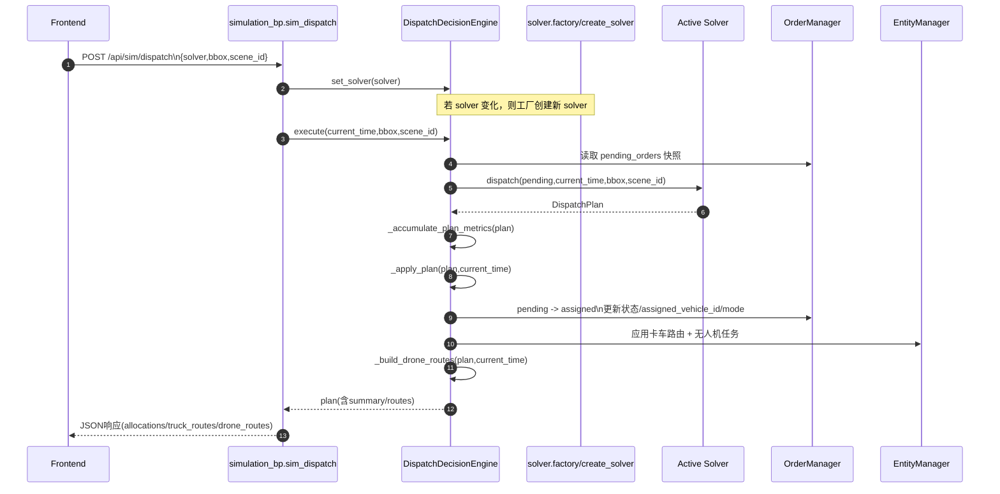
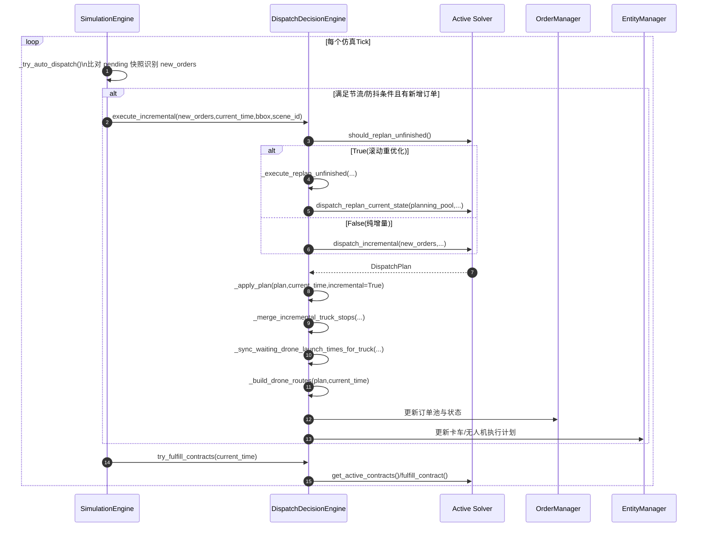

# DecisionEngine 当前职责图与关键调用时序图

本文档基于当前代码实现，给出 `DispatchDecisionEngine` 的职责分层与关键调用链路，供研发对齐。

- 代码基线：`backend/solver/decision_engine.py`
- 关联入口：`backend/api/routes/simulation_bp.py`
- 关联仿真循环：`backend/environment/state/sim_engine.py`

---

## 1. DecisionEngine 当前职责图

```mermaid
flowchart TB
  subgraph API层
    A1[POST /api/sim/dispatch\n(solver,bbox,scene_id)]
  end

  subgraph 编排层 DispatchDecisionEngine
    B1[set_solver / get_available_solvers]
    B2[execute 全量调度]
    B3[execute_incremental 增量调度]
    B4[_execute_replan_unfinished 滚动重优化]
    B5[_apply_plan 应用分配\n订单状态/车辆路径/无人机任务]
    B6[_merge_incremental_truck_stops\n后缀停靠稳定插入]
    B7[_recalculate_truck_route_timing_for_b_wait\nB_WAIT时序重算]
    B8[_setup_drone_routes 下发无人机路径]
    B9[_build_drone_routes 构建前端可视化路由]
    B10[get_runtime_metrics 运行时指标]
    B11[try_fulfill_contracts 契约兑现]
  end

  subgraph 求解层 Solver(工厂创建)
    C1[dispatch]
    C2[dispatch_incremental]
    C3[dispatch_replan_current_state]
    C4[should_replan_unfinished]
    C5[get_active_contracts / fulfill_contract]
    C6[build_incremental_route_from_stops]
  end

  subgraph 仿真层 SimulationEngine
    D1[attach_dispatch_engine]
    D2[_try_auto_dispatch\n检测新单并触发增量调度]
    D3[_run_loop 每Tick调用\ntry_fulfill_contracts]
  end

  subgraph 状态与实体
    E1[OrderManager\npending/assigned/completed]
    E2[EntityManager\ntruck/drone 实体状态]
  end

  A1 --> B1
  A1 --> B2

  B2 --> C1
  B3 --> C4
  B3 --> C2
  B3 --> B4
  B4 --> C3

  B2 --> B5
  B3 --> B5
  B4 --> B5

  B5 --> B6
  B5 --> B7
  B5 --> B8
  B2 --> B9
  B3 --> B9
  B4 --> B9

  B5 --> E1
  B5 --> E2

  D1 --> D2
  D2 --> B3
  D3 --> B11
  B11 --> C5

  B6 --> C6
  B10 --> D3
```

### 职责摘要

1. 入口编排：接收 API 层调度请求，切换 solver，触发执行。
2. 执行策略：支持全量调度、纯增量调度、滚动重优化三种路径。
3. 状态落地：将求解结果写入订单池与实体状态机，并下发卡车/无人机路径。
4. 增量安全：保护运行中路线，进行后缀停靠合并与时序修正，避免轨迹断裂。
5. 运行保障：统计运行时 KPI，并在每个 tick 尝试兑现 market 契约。

---

## 2. 关键调用时序图（全量调度链）

触发场景：前端点击调度按钮，调用 `POST /api/sim/dispatch`。



### 全量链关键点

1. `execute` 是 API 手动调度主入口。
2. solver 只负责产出 `DispatchPlan`，执行落地由 DecisionEngine 完成。
3. API 层会序列化计划并返回给前端展示。

---

## 3. 关键调用时序图（增量调度链）

触发场景：仿真运行中出现新单，由 `SimulationEngine._try_auto_dispatch` 自动触发。



### 增量链关键点

1. 增量由仿真循环自动触发，不依赖前端手动按钮。
2. 是否重优化由 solver 策略决定（`should_replan_unfinished`）。
3. 增量模式下重点是“后缀合并 + 时序修正 + 契约兑现”。

---

## 4. 目前对接约束（实现层）

若接入新 solver，至少要保证与 `DispatchSolver` 协议一致：

1. `dispatch(...)`
2. `dispatch_incremental(...)`
3. `should_replan_unfinished()`
4. `dispatch_replan_current_state(...)`
5. `get_active_contracts()` / `fulfill_contract(...)`
6. `build_incremental_route_from_stops(...)`

否则在增量调度或契约流程中会出现运行时缺口。

---

## 5. 备注

1. 文档中的图反映“当前实现”，不是抽象目标架构。
2. 若后续引入事件总线或任务编排器，可在本文件追加 v2 时序图做差异对比。
